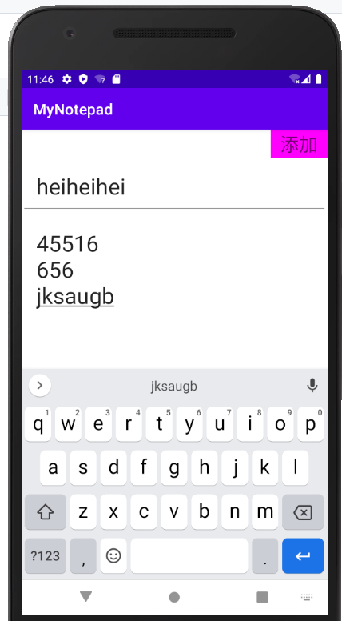
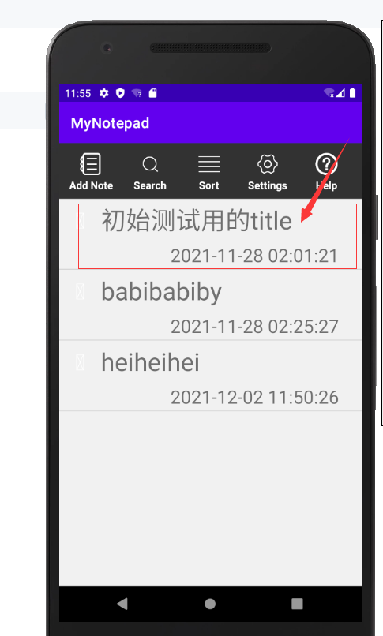

# mynotepad项目功能及部分功能实现介绍
## 本次mynotepad项目编码全是由自己编写，包括框架的搭建功能的实现，并没有使用到老师给到的框架
### 功能主要完成了以下内容：添加笔记、修改笔记、搜索笔记、删除笔记、笔记排序sort、设置背景颜色、显示笔记添加时间戳等功能
#### 运行SqliteTest文件，模拟器运行程序，登录后的首页面为：
##### 
#### 1、添加笔记
##### (1)点击模拟器中的Add Note:
#####     此时则会跳出编辑页面，编辑你要新建的笔记标题和内容，我们分别进行输入：
#####     
##### （2）点击右上角的添加后，则跳回index页面，同时新建的笔记本已经出现：
#####     
##### （3）直接单击新建的这个笔记，查看是否为刚刚输入的内容：
#####     
##### （4）addnote展示完毕
#### 2、修改笔记
#####  （1）此时index页面为，单击第一个（标题为：初始使用的title）笔记本进入编辑页面:
#####     
#####   (2)该笔记本的编辑页面初始为：editnotebegin.png
#####     
#####  （3）编辑该笔记后：
#####     
#####  （4）点击保存后页面自动跳回index页面，可以看到此时第一个笔记的标题已经变成我们编辑过的了（可以看到此时的时间戳已经改变）：
#####     
#####  （5）编辑功能展示完毕
#### 3、搜索笔记
#####  （1）由于此时只有3个笔记，我们再分别加入3个笔记用于“搜索笔记功能的展示”
#####     标题分别为：‘aaaa’,'abcd','bbb'
#####     此时，index页面展示图为：
#####     
#####  （2）点击上面的Search进入搜索页面：searchpage.png
#####     
#####  （3）此时在输入框中输入a,列表则显示出标题包含‘a’的笔记本:
#####     
#####   (4)此时更改输入框中的a，搜索‘b’,列表则显示出标题包含‘b’的笔记本:
#####     
#####  （5）也可对搜索列表中的笔记进行编辑和删除
#### 3、删除笔记
#####   （1）此时的index页面为：
#####     
#####   （2）长按标题为‘aaaa’的笔记本，后index页面为：
#####     
#####   （3）长按标题为‘heiheihei’的笔记本，后index页面为：
#####     
#####    删除功能展示完毕
#### 4、笔记排序sort
#####   （1）此时的index页面为：
#####     
#####   (2)点击上方的sort按钮，弹出选择sort的警示框：
#####     
#####   (3)点击标题升序后的index页面：
#####     
#####   (4)点击标题降序后的index页面：
#####     
#####   sort功能展示完毕
#### 5、设置背景颜色
#####   （1）此时的index页面为：
#####   
#####   （2）点击图片中标出的settings按钮，弹出设置背景dialog框：
#####   
#####   （3）选择黄色后：
#####   
#####   （4）选择第四个颜色后：
#####    
#####    设置背景颜色功能展示完毕
